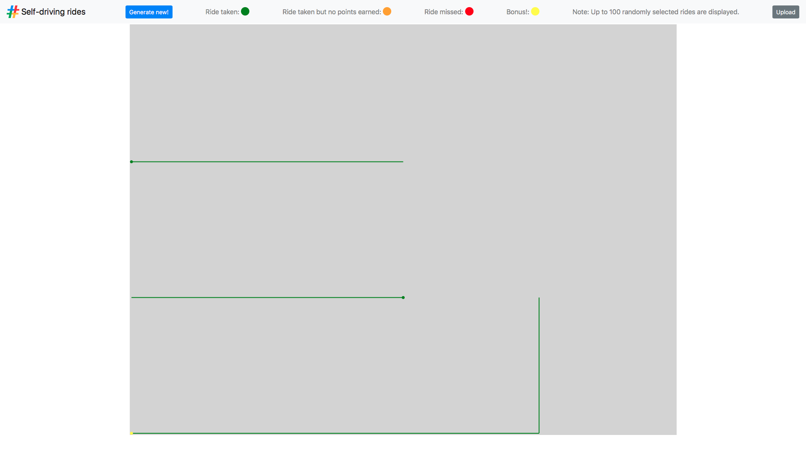
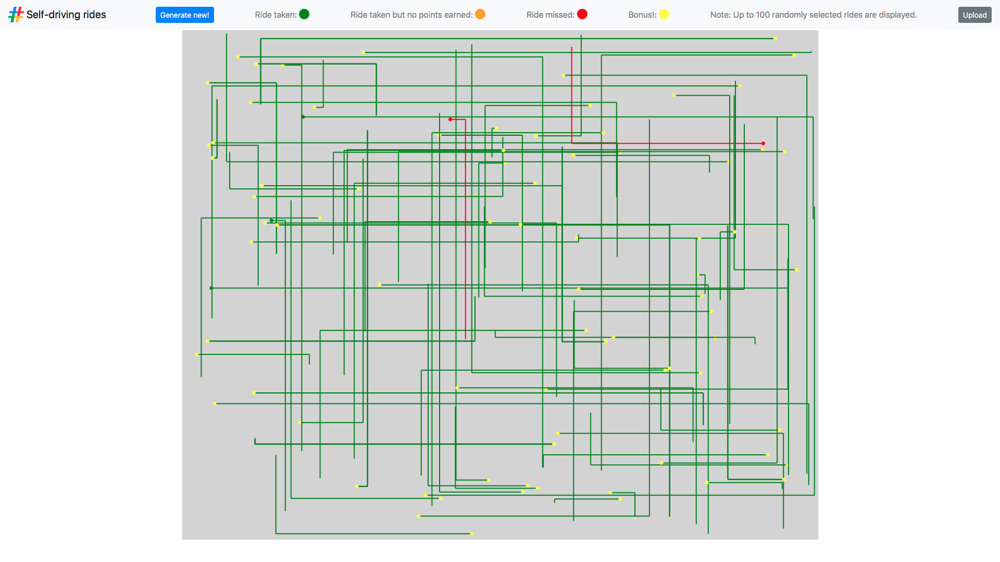
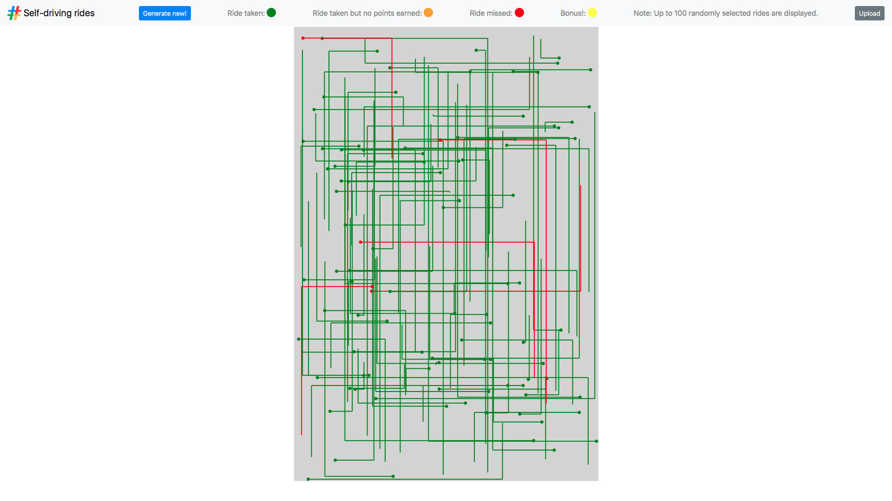
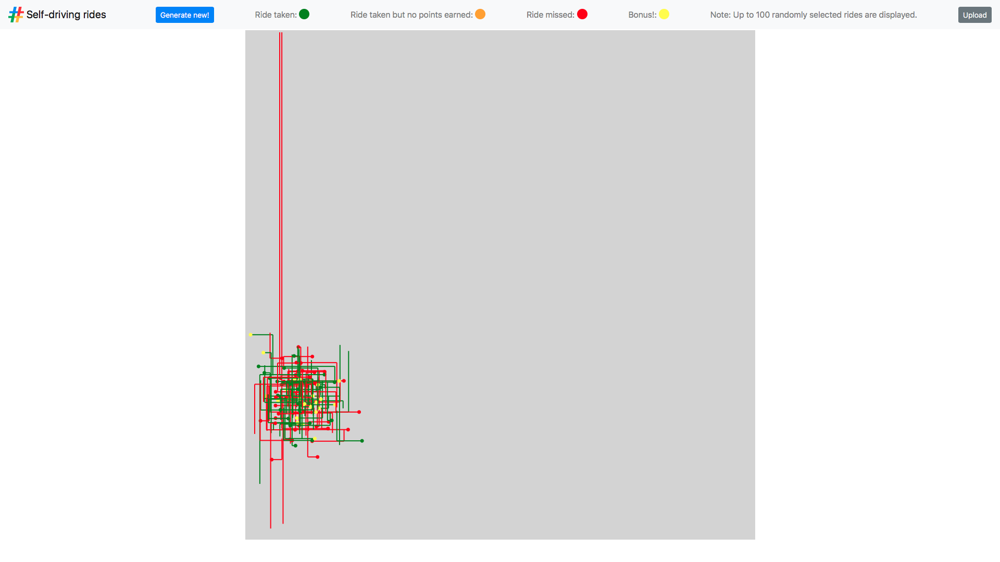
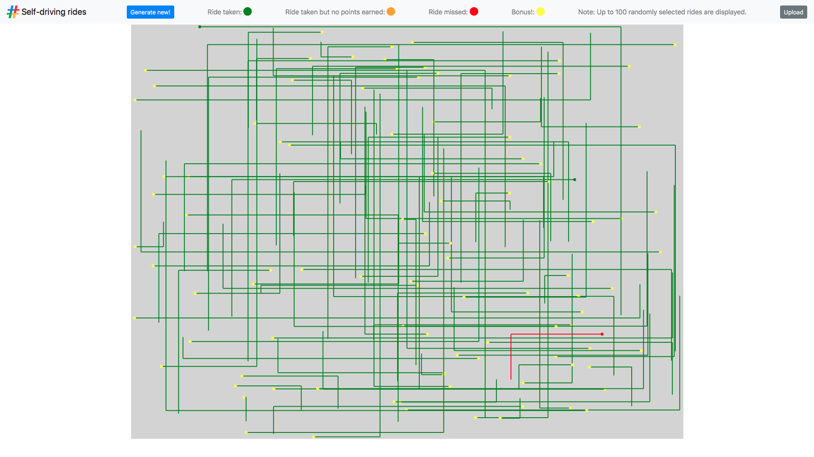
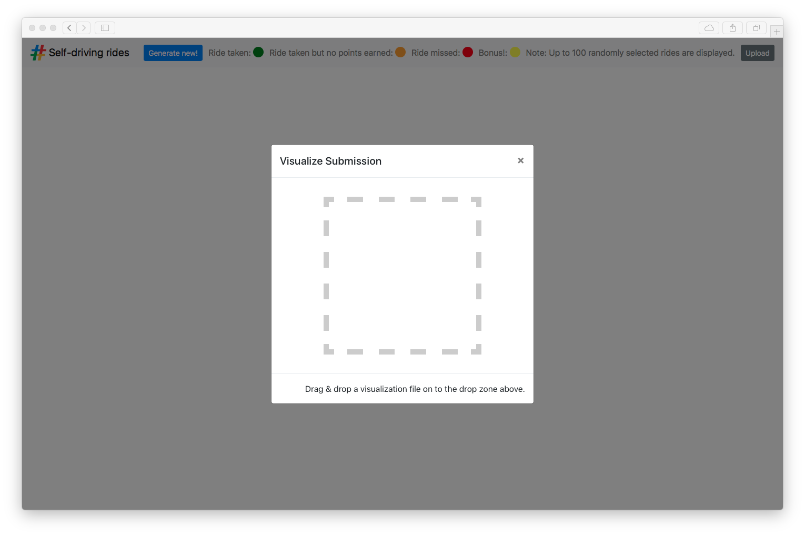

# Google \# Hash Code 2018 Online Qualification Round

Solutions and code for the [Google \# Hash Code 2018 Challenge](https://hashcode.withgoogle.com) **"Self-driving rides"**.

The problem statement can be found [here](online_qualification_round_2018.pdf).

The input files can be found in `input/`
- [example](input/a_example.in)  
    Map: `(3, 4)` Vehicles: `2` Rides: `3` Bonus: `2` Steps: `10`
- [should be easy](input/b_should_be_easy.in)  
    Map: `(800, 1000)` Vehicles: `100` Rides: `300` Bonus: `25` Steps: `25000`
- [no hurry](input/c_no_hurry.in)  
    Map: `(3000, 2000)` Vehicles: `81` Rides: `10000` Bonus: `1` Steps: `200000`
- [metropolis](input/d_metropolis.in)  
    Map: `(10000, 10000)` Vehicles: `400` Rides: `10000` Bonus: `2` Steps: `50000`
- [high bonus](input/e_high_bonus.in)  
    Map: `(1500, 2000)` Vehicles: `350` Rides: `10000` Bonus: `1000` Steps: `150000`

#### Introduction

> Millions of people commute by car every day; for example, to school or to their workplace.
>
> Self-driving vehicles are an exciting development for transportation.
> They aim to make traveling by car safer and more available while also saving commuters time.
>
> In this competition problem, we’ll be looking at how a fleet of self-driving vehicles can efficiently get commuters to their destinations in a simulated city. 
>
> _from [Problem statement for the Online Qualification Round of Hash Code 2018](online_qualification_round_2018.pdf)_

#### Task

> Given a list of pre-booked rides in a city and a fleet of self-driving vehicles,
> assign the rides to vehicles, so that riders get to their destinations on time.
>
> For every ride that finishes on time (or early), you will earn points
> proportional to the distance of that ride;
> plus an additional bonus if the ride also started precisely on time.
>
> _from [Problem statement for the Online Qualification Round of Hash Code 2018](online_qualification_round_2018.pdf)_

## Algorithm

## Scores

Overall **45,616,108** points.

#### Example
_`10`_ points, processed in `00:01 min`.

#### Should Be Easy
_`176,877`_ points, processed in `00:16 min`.

#### No Hurry
_`15,790,161`_ points, processed in `03:57 min`.

#### Metropolis
_`8,183,115`_ points, processed in `41:34 min`

#### High Bonus
_`21,465,945`_ points, processed in `15:05 min`

## Visualization

We saved the visualization from the [\# Hash Code Judge System](http://hashcodejudge.withgoogle.com)
and added a responsive layout.

Solutions can now be visualized by dropping their corresponding JSON file via drag & drop.

## Authors

Sebastian Brodehl / [@sbrodehl](https://github.com/sbrodehl)  
Tobias Kremer / [@tbkr](https://github.com/tbkr)  
Dennis Meyer / [@snakebite1457](https://github.com/snakebite1457)  
Moritz Schmidtgen / [@mschmi10](https://github.com/mschmi10)
